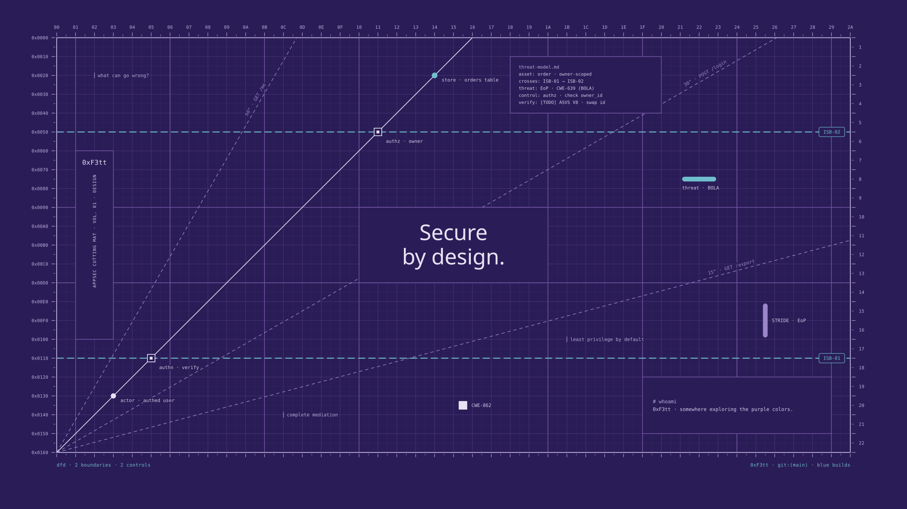

# kernspace

[](https://github.com/0xF3tt/kernspace/tags)
[](https://github.com/0xF3tt/kernspace/actions/workflows/ci.yml)
[](https://kernspace.vercel.app)
[](LICENSE)
[](LICENSE-ASSETS)
[](SECURITY.md)

*Privileged space, carefully kerned.*



Original visual resources for the cybersecurity and geek community: wallpapers first, more later. No hoodies, no green rain, no padlocks, no skulls. Every element on a sheet means something real in security, and every word is checked.

A proposal, not a rule: a different way cyber could look.

> **Status:** 1.0.0-beta.2. A web app renders Cutting Mat and Specimen wallpapers in your browser: pick a series, a preset, a palette, one of its three grounds and a format, swap any word for another from the topic's lexicon, fill in your `# whoami` (a handle and a line of your own, both needed to download), then download PNG or SVG. Your edits stay in your browser.

## How it works

Every piece is a combination of four things:

| Axis | What it is | Today |
|---|---|---|
| **Series** | A layout borrowed from graphic design, where each element carries a security meaning | `cutting-mat` (15 presets) · `specimen` (15 presets) · `galley-proof` · `catalog-card` (concepts) |
| **Topic** | A researched lexicon of one field's real vocabulary | 15 topics · 1,527 verified terms |
| **Palette** | A color system with three grounds, contrast-checked (WCAG) and color-vision checked | `purple` · `green` · `red` · `blue` |
| **Format** | Output size | `desktop` 3840×2160 · `wide` 3840×2400 (16:10) · `phone` 1290×2796 |

## Layout

```
kernspace/
├── series/      one folder per series: concept, element map, slots, presets
├── topics/      one lexicon per topic
├── palettes/    purple · green · red · blue
├── fonts/       type catalog + bundled OFL fonts
├── index.html   the web app
└── app/         app logic + one renderer per series (pure SVG)
```

## Run

The app is plain HTML, CSS and ES modules: no build step, no dependencies, no third-party requests. Nothing leaves the browser: every wallpaper is drawn locally as SVG and turned into a PNG on a canvas.

Serve the repo root with any static server and open it:

```sh
python3 -m http.server 8000
```

Check the renderer and the word editor (Node 20+, no installs):

```sh
node app/render.test.mjs
node app/words.test.mjs
```

The first renders every preset of both series in every palette, ground and format and runs each series' overlap checker (and checks that the checker fires on broken sheets); the second takes a sample of the words the editor offers for each series, applies them and runs the same checker on each result.

## Deploy

Vercel serves the repo root as a static site; [`vercel.json`](vercel.json) adds the security headers (a strict CSP with no inline code and no third-party origins, `nosniff`, `no-referrer`) and [`.vercelignore`](.vercelignore) leaves the research files out.

- **From GitHub:** import the repo in Vercel, framework preset *Other*, no build command, output directory `.` (the root).
- **From the CLI:** `vercel` for a preview, `vercel --prod` for production.

## Releases

Versions follow [SemVer](https://semver.org): `1.0.0-beta.N` while in beta, then `1.0.0-rc.N`, then `1.0.0`. The label on the site comes from [`version.json`](version.json), the only place it is written. To release: change it in a pull request, merge, then tag that commit with `v` + the version and push the tag. CI fails the tag if it doesn't match `version.json`. Release notes live in [GitHub Releases](https://github.com/0xF3tt/kernspace/releases).

```sh
git tag -s v1.0.0-beta.2 -m "1.0.0-beta.2" && git push origin v1.0.0-beta.2
```

## Palettes

| Palette | Dark | Mid | Light | Story |
|---|---|---|---|---|
| `purple` | aniline | indigo | ditto | Spirit-duplicator inks; red + blue, both sides on one sheet |
| `green` | phosphor | soldermask | greenbar | CRT phosphor, circuit boards, line-printer paper |
| `red` | oxide | rubric | redline | Magnetic oxide, rubricated headings, the red pencil |
| `blue` | iron-gall | cyanotype | whiteprint | The blueprint's own chemistry |

## Roadmap

1. ~~Name, series concepts, palettes~~
2. ~~Topic lexicons (15)~~
3. ~~Web app (Beta 1): Cutting Mat, 3 presets, 4 palettes, 3 formats, custom handle~~
4. ~~Cutting Mat presets for all 15 topics~~
5. ~~Specimen series: renderer, series switch and all 15 topics~~
6. New series: Galley Proof, Catalog Card
7. Lint for lexicons, palettes and presets in CI

## How it's made

Designed and directed by [0xF3tt](https://github.com/0xF3tt). Research and development assisted by AI. Images are rendered deterministically from code (pure SVG rendered in your browser and exported via canvas). No image is produced by an image-generation model.

## License

| What | License |
|---|---|
| Images, lexicons, palettes, series docs | [CC BY-NC-SA 4.0](LICENSE-ASSETS): share and remix with credit, no commercial use, remixes keep the same license |
| Code (`app/`, renderers, tests) | [PolyForm Noncommercial 1.0.0](LICENSE): free for noncommercial use |
| Fonts | Their own licenses; see the [font catalog](fonts/README.md) |

Because of the noncommercial terms, kernspace is *free for the community*, not "open source" in the OSI sense. Want to use something commercially (a conference, a CTF, merch)? Ask: exceptions are granted case by case.
